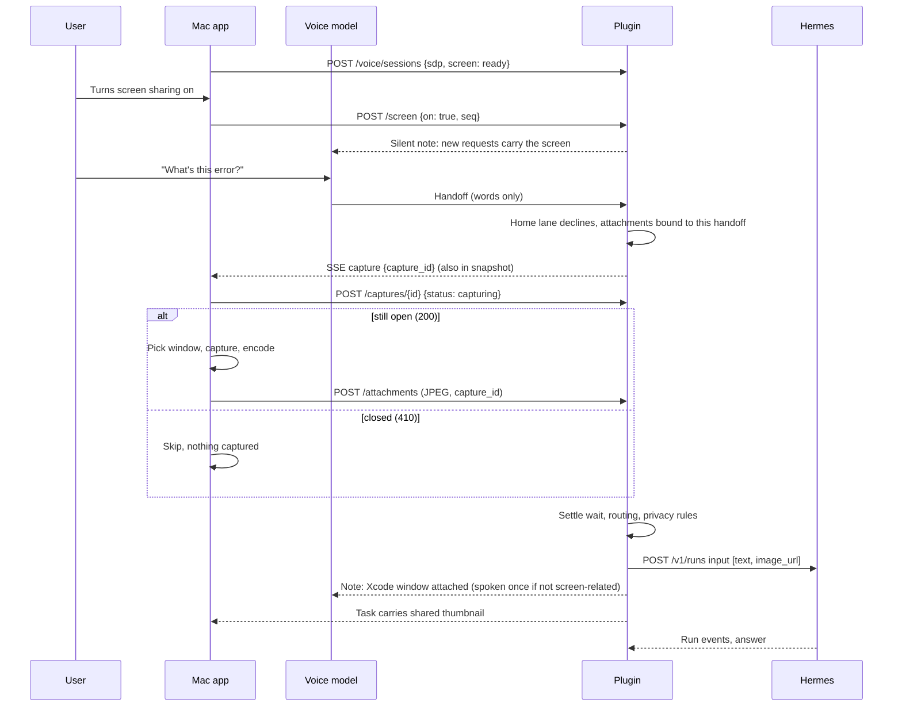
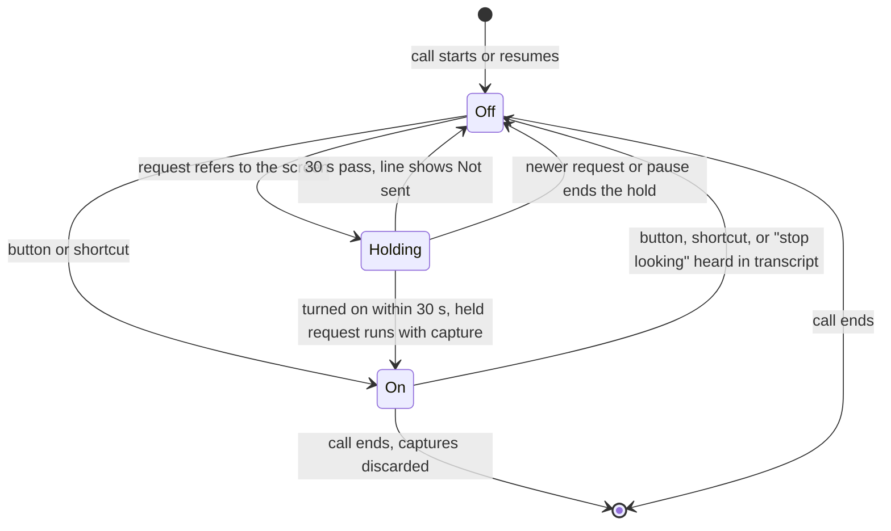
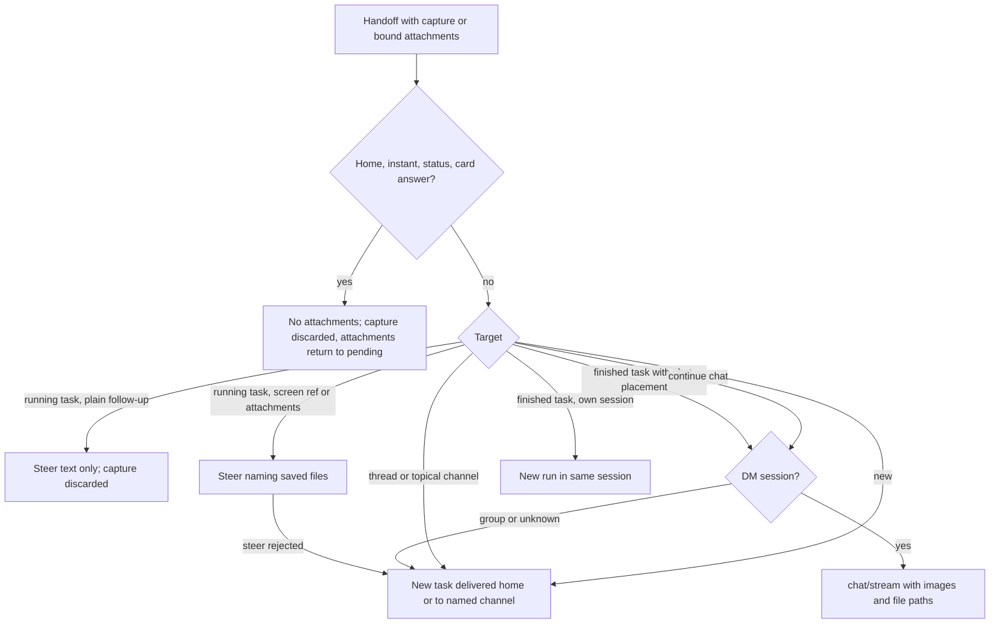

# feat: Look at this — share your screen, a picture or a file with a spoken request

## Summary

Let Hermes see what the user sees.
- **Screen:** a per-call screen button in the voice panel, off by default, attaches a capture of the frontmost window to each new piece of Hermes work.
- **Pictures and files:** dropping or pasting one onto the panel sends it with the next request.
- **Privacy:** everything travels only from the Mac to the user's own Hermes. Images go as image parts on the task; other files are saved on the Hermes machine and named in the task.

## Problem Frame

Speakeasy is voice-only today. "What's this error?", "reply to this email" or "is this layout right?" give Hermes words with nothing to point at, so the task guesses or fails. The Mac is the one place Speakeasy can see what the user is looking at. Hermes already accepts images on new runs and on continued chats, but Speakeasy sends only text.

The user asked for screen capture to stay off unless they turn it on during the call, with a quick on/off control and a very clean UI.

---

## Requirements

**Screen sharing control**

- R1. Sharing is off at the start of every call and every resume. One button in the panel header and a recordable shortcut (default ⌃⌥S, active only during calls) turn it on or off.
- R2. While sharing is on, the button stays visible in every panel layout and the menu-bar icon is tinted.
- R3. While sharing is off, Speakeasy never captures the screen.
- R4. If Screen Recording permission is missing, the button stays off. A one-line hint leads to Settings, where the user can allow it and relaunch.
- R5. "Stop looking at my screen" turns sharing off even if the voice model doesn't hand it off. "Share my screen" explains the button instead of starting a task. The voice can never turn sharing on.

**Capture and attach**

- R6. While sharing is on, each new Hermes run started during the call carries one capture of the frontmost non-Speakeasy window, taken for that request. That covers a new task, a follow-up that starts a new run, and a continued chat. A capture is never reused for another request, and never taken after its request has closed.
- R7. Some requests never carry images: home control, instant and quick answers, status questions, and question-card answers. A request that refers to the screen, or arrives while attachments are pending, skips the quick lanes. It also never triggers Speakeasy's "show me the task's picture" behavior.
- R8. A screen-referring request or attachments aimed at a running task reach that task as a steer. The steer points to the saved files, which Hermes can open itself. If the steer is rejected, they start a new task that references it.
- R9. Speakeasy refuses to capture, with a reason, when:
  - one of its own regular windows is active;
  - a password manager is frontmost;
  - the frontmost app holds secure keyboard input.

  A blank frame counts as a failed capture.
- R10. On a client that can share, asking to look while sharing is off holds the request. The voice says how to turn sharing on, the button pulses, and a "Waiting for your screen" line appears, also in the slim panel. Turning sharing on within 30 seconds runs the held request with a capture. Otherwise the line ends as "Not sent: screen sharing was off". A newer request or a pause also ends the hold.

**Pictures and files**

- R11. During a call the user can drop or paste up to 3 attachments onto the panel. They show as removable thumbnails, go with the next Hermes work whether or not sharing is on, and survive pause and resume.
- R12. Attachment handling depends on type:
  - **Pictures** go to Hermes as images.
  - **Other files** up to 10 MB (PDFs, logs, documents, data) are saved on the Hermes machine and named in the task, so Hermes opens them with its own tools.
  - **Folders, app bundles and links** are refused with a short message.

**Privacy and limits**

- R13. Attachments go only from the Mac, to the plugin (authenticated device token), to the user's Hermes. They never reach:
  - the voice model;
  - the routing and naming models;
  - quick-answer search or Jev;
  - chat notices or the call log;
  - continuity snippets or logs.
- R14. Attachments never enter a group chat's Hermes session. Results of attachment-bearing requests go to the home destination unless the user named a channel.
- R15. The Mac re-encodes every image: long edge ≤ 1568 px, metadata stripped, about 300 KB.
  - A request carries at most 4 images and 6.5 MB of image bytes.
  - A capture that won't fit is dropped with a spoken reason.
- R16. Unattached captures are discarded from memory. Speakeasy's copies of attached files are deleted when the task is cleared or after 7 days. Images sent to Hermes stay in that task's (or continued chat's) Hermes session for as long as Hermes keeps it, and later runs in that session send them again. The privacy docs say so plainly.

**Honesty and compatibility**

- R17. The voice speaks in first person without claiming to see anything ("I'll take your screen along with that"). It never describes screen contents before a result arrives.
  - The first capture in a call that goes with a request not about the screen is announced once, with the app name.
  - Failed captures are spoken with their reason, and the work goes ahead with the user's words.
- R18. A task that carried a screen, picture or file shows a small confirmation (thumbnail or file chip).
- R19. The plugin reports whether Hermes can read images, natively or through a vision model that describes them. The Mac hides the button and refuses drops when it can't, or when the plugin predates the feature.
- R20. The shared client code keeps building for iOS and visionOS. ScreenCaptureKit stays in the Mac app target.
- R21. Holds, hints and capture requests apply only to calls whose client declared it can share. iPhone calls and older Mac apps keep today's behavior.

---

## Scope Boundaries

- No continuous screen streaming, and the voice model itself gets no screen access.
- One frontmost window per request, including its attached sheets. No region picking.
- Dropping something outside a call does not start a call.

### Deferred to Follow-Up Work

- An optional Screen Recording step in onboarding.
- `SCContentSharingPicker` as a fallback that needs no permission.
- Image parts on webhook-thread posts (Hermes accepts text only there today). Steers use saved-file paths instead.
- Treating "look at this" as a question about Speakeasy's own image preview when that preview is open.
- Turning sharing off automatically after a long quiet stretch in a call.
- Running image-bearing tasks in throwaway Hermes sessions so follow-ups don't re-send old screenshots.
- Pruning the existing, unbounded `cache/speakeasy/images` folder. That problem predates this plan; only the new `shared` folder is pruned here.
- A plugin-served password-manager denylist (the first version compiles it into the Mac app).
- Attaching photos from iPhone, which can reuse the upload client added here.

---

## Assumptions

These are untested bets made without the user, in pipeline mode. Review them first.

- While sharing is on, every new Hermes run carries a capture, not only requests that mention the screen. This matches the "on means it can see" model of comparable apps. The cost is extra image tokens, and unrelated screen content reaching the model provider. The one-time spoken notice (R17) offsets this.
- Sharing resets to off at every call start and resume. There is no saved default.
- Successful attaches are otherwise confirmed silently, with a note to the voice and a thumbnail.
- An expired hold is not run text-only. The voice already told the user what to do, and "what's this?" without the screen is useless.
- When a regular Speakeasy window is active (Settings, image preview, onboarding), the capture is refused rather than taking the app behind it.
- In SSE polling-fallback mode, capture requests are served through the interaction snapshot, polled every 700 ms.
- The default shortcut is ⌃⌥S, recordable like Mute and Pause.

---

## Key Technical Decisions

**Capture coordination**

- **The plugin asks the Mac to capture.** The plugin owns handoffs for both voice backends; the Mac never sees Codex handoffs.
  - A `capture` SSE event follows the `show` event precedent. It is published once a handoff passes the home-control lane, so the capture overlaps the ~1.5 s settle wait and routing.
  - If sharing comes on later, the capture is requested at task start instead.
  - Open requests also appear in the interaction snapshot, so polling clients get them.
- **The plugin decides whether a capture is still wanted.** On a `capture` event, the Mac first posts `capture-status: capturing`. The plugin answers 410 for closed requests, so the Mac never captures for a stale or replayed event, with no clock math. The same route takes `failed` with a reason, which stops the wait and picks the spoken line.
  - Uploads attach strictly by capture id.
- **Clients declare whether they can share.** The `/voice/sessions` body gains an optional `screen` field: `ready` or `no_permission`. The Mac sends it only when status advertises attachments, so an old plugin never sees an unknown key.
  - Only declared calls get capture requests, holds and hints.
  - `no_permission` calls get a Settings hint instead of a hold.
- **The plugin catches "stop looking" itself.** Stop phrases are matched on the user's transcript as it arrives (`session.input_transcript.delta`), so sharing turns off even if the voice model answers without handing off.
  - `rules.md` also tells the voice to always hand off requests to look at the screen.

**Transport and sending to Hermes**

- **Raw upload route with its own cap.** Image and file bytes go to a dedicated route; the JSON routes keep their 128 KB limit. Metadata travels in headers.
- **Canonical `image_url` data-URL parts in the `/v1/runs` `input` list.** Hermes passes runs input to the agent without normalizing it, so the `input_image` spelling is not translated there.
  - A request with no images still sends a plain string, so existing behavior and tests are unchanged.
  - Continued chats send the same parts as `message`, which that route does normalize.
- **Files and steers carry paths, not bytes.** Attachments are written to the speakeasy `shared` cache folder on the Hermes machine.
  - Non-image files are named in the task prompt, so Hermes opens them with its own file tools.
  - A steer into a running task names the saved screenshot so Hermes can open it with `vision_analyze`. This avoids forking a second agent mid-task.
- **Detect support in-process, off the request path.** The plugin runs inside Hermes. At startup and then hourly, it checks for Hermes' image input routing and a vision path (a vision-capable main model, or an auxiliary vision backend). It caches the result as `attachments.vision` = `native`, `described`, `none` or `unknown`. Detection can make network calls, so `/voice/status` only reads the cache.

**Sizes and limits**

- **Sized for re-sending, not just for intake.** Hermes sends every user image in a session again on each later model call. Its own target for images kept in a session is 1568 px and 256 KB, and Anthropic caps images at 2000 px once a request carries more than 20.
  - Encode JPEG with the long edge ≤ 1568 px, aiming for about 300 KB through a quality ladder.
  - Hard caps: 2.5 MB per image and 6.5 MB per request, which stays under Hermes' 10 MB limit after base64.
  - Files up to 10 MB are never inlined.
- **Continued-chat streams don't count the echoed message.** Hermes repeats the outgoing message, data URLs included, in `run.started`. The plugin's 4 MB stream budget starts after that event.

**Window choice**

- **Pick the window by z-order, capture with ScreenCaptureKit.**
  - `CGWindowListCopyWindowInfo` is front-to-back and works without permission; `SCShareableContent.windows` is not z-ordered.
  - Take the frontmost app's frontmost layer-0 window. When that window sits inside a larger window from the same app, treat it as a sheet: target the larger window and capture both, cropped to their union. Include overlapping windows from the open/save panel service.
  - Capture with `SCScreenshotManager.captureImage` (macOS 14+). `CGWindowListCreateImage` is obsoleted in macOS 15.
- **Check permission with `CGPreflightScreenCaptureAccess`; never poll ScreenCaptureKit.** Probing `SCShareableContent` without permission shows the system dialog again each time. A grant needs a relaunch, so the permission flow lives in Settings; the panel only links there.
- **Secure input is checked against its owner.** Refuse only when the process holding secure input (`kCGSSessionSecureInputPID`) is the frontmost app, and name that app. A secure input stuck in another app doesn't block captures.

**Privacy and storage**

- **Group-session guard at the point of use.** The DM-only rule lives in `start_continuity_task`, so it covers both new continuity and follow-ups to finished thread tasks. A missing `chat_type` counts as group.
- **Stored multimodal messages are reduced to text before continuity uses them.** Hermes stores list content in `state.db` as `"\x00json:" + JSON`, and continuity snippets reach the routing model.
- **ScreenCaptureKit lives in the Mac app target.** `SpeakeasyClient` gets a platform-neutral upload API and an injected capture closure. The encoder uses ImageIO, which iOS and visionOS also have.

---

## High-Level Technical Design

A spoken request with sharing on. Where the diagram and the unit prose disagree, the prose wins.

Sharing state for one call that declared `screen: ready`:

How a request with attachments is routed:

---

## Implementation Units

### U1. Image-capable task start and capability detection

**Goal:** Let the backend contract, the Hermes client and continued chats carry image parts. Report whether Hermes can read images, and keep image data out of continuity snippets.

**Requirements:** R6, R13, R15, R19

**Dependencies:** none

**Files:**
- Modify: `plugin/speakeasy/backends/base.py`, `plugin/speakeasy/hermes_api.py`, `plugin/speakeasy/continuity.py`, `plugin/speakeasy/service.py`
- Modify: `plugin/tests/fakes.py`
- Test: `plugin/tests/test_attachments_backend.py`

**Approach:**
- Add an `images` capability and an optional `images` argument to `start_run`. Non-Hermes backends ignore it.
- `HermesAPI.start_run` sends a string when there are no images. Otherwise it sends a one-message `input` list: the text part plus one `image_url` data-URL part per image.
- `stream_session_chat` accepts the same list content as `message`. Its 4 MB stream budget starts counting after `run.started`.
- Detection runs at startup and then hourly, on `VoiceService._idle_loop`, and caches its result. `service.status()` reports `attachments: {images, vision, max_attachments, max_image_bytes, max_file_bytes}` from the cache. Any detection failure reads as `unknown`.
- `_snippets` decodes `"\x00json:"` content and keeps only its text parts.

**Patterns to follow:** `threads_supported` reporting in `service.status()`; `HermesAPI` request helpers; `settle_stuck_tasks` on `_idle_loop`.

**Test scenarios:**
- Happy path: a run with two images records an `input` list with a text part and two `image_url` parts whose URLs start `data:image/jpeg;base64,`.
- Happy path: a run with no images records `input` as a plain string.
- Happy path: a continued chat with one image posts `message` as a list. A `run.started` echo of a two-image message doesn't trip the stream budget, and the turn completes.
- Edge case: when the routing module isn't importable, status reports `images: false`. When detection raises, `vision: "unknown"`. Status never blocks on detection.
- Edge case: a `state.db` user message stored as `"\x00json:"` with text and an image yields a snippet with only the text and no `base64`.
- Integration: a retried image run reuses the idempotency key, and the fake server returns the same run id.

**Verification:** Existing plugin tests pass unchanged. The new tests cover both input shapes, the echo budget and the snippet sanitizer.

---

### U2. Attachment intake, capture requests and per-call state

**Goal:** Accept captures, pictures and files from the Mac, bind captures to requests, record what the client can do, mirror the toggle, and expose it all in the snapshot.

**Requirements:** R1, R3, R6, R11, R12, R13, R15, R16, R19, R21

**Dependencies:** U1

**Files:**
- Create: `plugin/speakeasy/attachments.py`
- Modify: `plugin/speakeasy/server.py`, `plugin/speakeasy/service.py`, `plugin/speakeasy/calls.py`, `plugin/speakeasy/store.py`
- Test: `plugin/tests/test_attachments_route.py`

**Approach:**

*Routes:*
- `POST /voice/sessions` accepts an optional `screen: ready | no_permission`, kept on the interaction and carried into resumes.
- `POST /voice/interactions/{id}/attachments` reads a raw body with its own caps and a required `Content-Length`. It bypasses `_body()`.
  - Headers carry kind (`screen`, `picture`, `file`), an optional capture id, a source app name, and a filename for files.
  - Images are sniffed with `cards._sniff`. Files are accepted as regular data with a sanitized name; executables are not marked runnable.
  - Errors:
    - 415: the bytes don't match the declared image type.
    - 413: over the size cap.
    - 404: unknown call.
    - 409: the call has ended, or the upload is over budget (with a reason).
    - 410: the capture request is closed.
  - A repeat upload for the same capture id returns the same attachment.
- `DELETE /voice/interactions/{id}/attachments/{attachment_id}` needs a new `do_DELETE` handler. It removes a pending attachment, and returns 409 once it has been sent.
- `POST /voice/interactions/{id}/screen` takes exactly `{on, seq}`. Older sequence numbers are ignored. Turning sharing off closes open capture requests.
- `POST /voice/interactions/{id}/captures/{capture_id}` takes `{status, reason?}`:
  - `capturing`: 200 while the request is open, otherwise 410.
  - `uploading`: extends the wait.
  - `failed`: closes the request and records the reason.

*State:*
- `CallAttachments` holds sharing state, the client's declaration, pending attachments, and open capture requests with deadlines. It also holds per-handoff bound attachment sets and the byte budget.
- It lives in memory, is thread-safe across server threads and the worker loop, and clears on call end.
- A resumed interaction starts with sharing off and nothing pending. The Mac re-uploads its pending attachments.
- The interaction snapshot gains sharing state, open capture requests, pending attachment ids and the hold line.

*Storage:*
- Attached files are written atomically, under content-hash names, to `<HERMES_HOME>/cache/speakeasy/shared/`.
- Clearing a task deletes them. A prune on `_idle_loop` (hourly, plus at startup) removes files older than 7 days.

*Notes and logging:*
- Toggle and drop changes send silent notes to the voice.
- Bodies and file contents are never logged.

**Patterns to follow:** the `early-request` route (strict body, call-connected wait, `run_coroutine_threadsafe`); `cards._sniff`; atomic writes in `text.saved_data_images`; `P.early_request_note`.

**Test scenarios:**
- Happy path: a valid JPEG picture returns an id, and the snapshot lists one pending attachment.
- Happy path: a 2 MB PDF file is stored under `shared/` with its sanitized name and listed as pending.
- Happy path: `{on: true, seq: 1}` then `{on: false, seq: 2}` flips sharing and sends one silent note each.
- Happy path: `capturing` then an upload for an open capture id is accepted. A second upload with the same id returns the same attachment.
- Error path: PNG bytes declared as `image/jpeg` → 415.
- Error path: a body over its cap → 413 without reading it fully.
- Error path: a fourth attachment, or an image that would leave no room for a capture → 409 with a reason.
- Error path: `capturing` or an upload for a closed capture id → 410, nothing stored.
- Error path: missing or wrong device token → 401.
- Error path: `{on: "yes"}` or extra keys → 400.
- Error path: an unknown `screen` value in the sessions body → 400.
- Edge case: `{on: true, seq: 1}` arriving after `{on: false, seq: 2}` is ignored.
- Edge case: a filename with `../` or slashes is stored under a sanitized name inside `shared/`.
- Edge case: deleting a pending attachment removes it. Deleting an unknown id → 404.
- Edge case: clearing a task deletes its shared files. A file older than 7 days is removed by an idle-loop tick.
- Integration: logs captured during uploads contain no file bytes or base64.

**Verification:** Routes behave as specified. Call end and resume leave no stale state.

---

### U3. Dispatch integration: capture, attach, route safely

**Goal:** Request captures for work headed to Hermes. Attach images and files only where they can go, and keep them out of every other path and every group session.

**Requirements:** R6, R7, R8, R9, R11, R12, R13, R14, R15, R17, R18, R21

**Dependencies:** U1, U2

**Files:**
- Modify: `plugin/speakeasy/calls.py`, `plugin/speakeasy/router.py`, `plugin/speakeasy/quick.py`, `plugin/speakeasy/prompt/builder.py`, `plugin/speakeasy/prompt/rules.md`, `plugin/speakeasy/store.py`, `plugin/speakeasy/server.py`, `plugin/speakeasy/service.py`
- Test: `plugin/tests/test_screen_dispatch.py`, `plugin/tests/test_attachment_privacy.py`

**Approach:**

*Binding:*
- Once a handoff passes the home-control lane, it claims the pending attachments, binding them to its delegation. In a call that declared `ready` with sharing on, it also gets a capture request.
- If no capture was requested and the handoff reaches task start while sharing is on, the request is made there.
- Dropped, absorbed or ignored handoffs close their capture request and return their attachments to pending.

*Screen references:*
- A conservative screen-reference matcher in `router.py` matches phrases like "my screen", "this window", "look at this" and "what's this error". A must-not-match list ("look at this weekend's forecast") guards it.
- When the matcher fires, or attachments are bound:
  - skip the instant and quick lanes;
  - bypass `is_show_me`, except "show me what you're looking at", which still means the task's own view;
  - suppress `decision.show` and thread `wants_to_see`.

*Attaching:*
- At `start_task` and `start_continuity_task`, use the handoff's bound attachments plus its capture.
- Wait up to 2.5 s for the capture, or up to 6 s while the Mac reports `uploading`.
- Enforce the budget, dropping the capture first with a reason.
- Images become image parts. Files and every saved attachment's path go in one prompt block, e.g. "The user shared a screenshot of their Xcode window and the file report.pdf at <path>".
- Record `shared` on the task.
- If a run in a session that earlier had a screenshot has none of its own, add a line: "no new screenshot; the last one is from HH:MM".

*Routing an attachment-bearing request:*
- **Running task:** a steer whose text names the saved paths, so the task opens them with `vision_analyze` or its file tools. A rejected steer falls back to a new task referencing it.
- **Plain follow-up to a running task:** steers as text only and discards the capture.
- **Group sessions:** `start_continuity_task` refuses group or unknown `chat_type` and hands off to `start_task`, delivered home. This also covers follow-ups to finished thread tasks.
- **Thread and topical channels:** go through `start_task`, delivered home or to a channel the user named.
- **Split requests:** the parts share one capture, and every part gets the attachments.
- **Clarify answers:** keep the original capture.
- **Question-card answers:** never capture.

*Voice honesty:*
- After attaching, a silent note: "Hermes has a screenshot of Xcode".
- The first capture of the call that goes with a request not about the screen gets one spoken line naming the app.
- Each failure reason gets one spoken commentary line: permission, timeout, no window, Speakeasy window, password manager, secure input, blank, budget, or sharing turned off.

*Display:*
- Public task info gains `shared: [{kind, app?, name?}]`.
- `GET /voice/shared-image/{run_id}/{n}` serves images through `vetted_local_image`.

*`rules.md` Screen section:*
- Speak in first person ("I'll take your screen along with that").
- Never describe or claim to have seen the screen before a result arrives.
- Always hand off any request to look at, share or stop sharing the screen, even when sharing is off.
- Never say sharing started or stopped until a note says so.

**Execution note:** Write the privacy-sink test first. It records every string sent to the routing call, titler, quick search, Jev, notices, call log, voice appends and continuity snippets, and asserts none contains image data or file contents.

**Patterns to follow:** `SidebandWorker.show_action` for SSE commands; `_take_show` for request-scoped flags; the `ThreadError` fallback in `start_thread_task`; `P.pictures_note` for honest counts; `P.SCREENSHOT_STEER` for steer wording.

**Test scenarios:**
- Happy path: sharing on, "what's this error?" → one `capture` event. After the upload, the run input has text plus one image, and the task's `shared` lists app "Xcode".
- Happy path: a dropped picture plus "make this the header image" with sharing off → the run carries only the picture, and the pending list empties.
- Happy path: a dropped PDF plus "summarize this" → the run's prompt names the saved path and carries no image part.
- Happy path: a follow-up to a finished task in its own session with sharing on → a new run in the same session with the capture.
- Edge case: a call without a `screen` declaration says "look at my screen" → a normal text-only run, with no capture or hold.
- Edge case: sharing on, "kitchen lights to 30%" → home control answers and no capture event is published.
- Edge case: sharing on, "what time is it in Tokyo" → the instant lane answers, and any capture is discarded.
- Edge case: sharing on, "what's this error?" → the quick web-search lane is skipped.
- Edge case: sharing on, "what's on my screen" → captured. "Show me what you're looking at" → the task's own view.
- Edge case: "look at my screen" never sets `decision.show` or `wants_to_see`.
- Edge case: handoffs A and B arrive close together and B's capture uploads first → A never receives B's image.
- Edge case: handoff A is still routing when a picture is dropped and B is spoken → only B's run carries the picture.
- Edge case: a plain follow-up to a running task → steer text only, capture discarded silently.
- Edge case: "what's this?" to a running task with sharing on → a steer naming the saved screenshot path. If the steer is rejected → a new task referencing it, with the capture.
- Edge case: a continuity candidate that is a group chat, or has no `chat_type` → a new task, delivered home.
- Edge case: a follow-up with a capture to a finished thread task in a group channel → a new task, delivered home.
- Edge case: a topical channel route with attachments → delivered home. "Post it in #work" → delivered to #work.
- Edge case: a split "do X and also Y" → both runs carry the same capture and the bound attachments.
- Edge case: a question-card answer never waits for or carries a capture.
- Edge case: 3 pictures plus a capture over the byte budget → the capture is dropped, and a spoken reason is sent.
- Edge case: the first capture in a call on "remind me to call Sam" → one spoken notice naming the app. The second such capture stays silent.
- Error path: no upload within the wait → a text-only run, and the timeout line is spoken.
- Error path: `failed reason=secure_input` → a text-only run right away, and the matching line is spoken.
- Error path: sharing is turned off after the request but before attach → the image is discarded, the run is text-only, and the line is spoken.
- Integration: across all of the above, the privacy-sink test finds no `base64`, image bytes or file contents in any sink outside Hermes.

**Verification:** Every dispatch path follows R6–R8, R14 and R21, and the privacy-sink test passes.

---

### U4. Hold and spoken screen intents

**Goal:** Handle "look at my screen" while sharing is off, "stop looking" whether or not the voice hands it off, and "share my screen".

**Requirements:** R5, R10, R17, R21

**Dependencies:** U2, U3

**Files:**
- Modify: `plugin/speakeasy/calls.py`, `plugin/speakeasy/router.py`, `plugin/speakeasy/prompt/builder.py`
- Test: `plugin/tests/test_screen_hold.py`

**Approach:**
- **Hold.** In a call that declared `ready`, with sharing off, a screen-matcher hit holds the request (one at a time) and publishes `screen.hint`.
  - The voice line names the button and the shortcut. The hold shows as a "Waiting for your screen" line that the slim summary also carries.
  - Turning sharing on within 30 s requests a capture and dispatches the held request through the normal path.
  - On expiry, a newer handoff, or a pause, the line ends as "Not sent: screen sharing was off".
- **No permission.** In a call that declared `no_permission`, the same match gets a spoken Settings hint and runs nothing.
- **Stop phrases.** These are matched on `session.input_transcript.delta` fragments as they arrive and on handoffs. Sharing turns off, `screen.state` is published, and a short confirmation is spoken. No Hermes task starts.
- **"Share my screen" / "turn on screen sharing"** gets the hint without a task.
- **Event payloads:** `screen.hint {reason}` and `screen.state {on, seq}`.

**Patterns to follow:** the `early_request` and `answered_note` notes; the `answer_status` lane for requests that end without a task; `handle_event` transcript handling.

**Test scenarios:**
- Happy path: sharing off, "look at my screen" → no capture, a `screen.hint` event, a hold line. Sharing on within 30 s → a capture event and a run with the image.
- Edge case: the hold expires → no run, and the line reads "Not sent".
- Edge case: a second request during a hold → the first line ends as "Not sent", and the second is routed normally.
- Edge case: pausing during a hold ends it.
- Edge case: a `no_permission` call says "look at my screen" → the Settings hint is spoken, with no hold and no run.
- Edge case: "stop looking at my screen" in the transcript with no handoff → sharing off and a `screen.state` event, with no Hermes task.
- Edge case: "share my screen" → a hint and no task, and sharing stays off.
- Edge case: the must-not-match phrases never create a hold.

**Verification:** No held request ends without a visible outcome, and "stop looking" works with or without a handoff.

---

### U5. Mac screen capture and attachment encoding

**Goal:** Capture the right window safely, and turn any dropped item into an upload.

**Requirements:** R3, R4, R9, R12, R15, R20

**Dependencies:** none

**Files:**
- Create: `mac/Sources/Speakeasy/Native/ScreenCapture.swift`
- Create: `mac/Sources/SpeakeasyClient/AttachmentEncoder.swift`
- Create: `mac/Sources/SpeakeasyCore/AttachmentPolicy.swift`
- Test: `mac/Tests/SpeakeasyCoreTests/AttachmentPolicyTests.swift`

**Approach:**
- **Permission.** `ScreenCapture` lives in the Mac target only. It reports permission via `CGPreflightScreenCaptureAccess`, requests it once via `CGRequestScreenCaptureAccess`, and opens the Screen Recording settings pane.
- **Refusals**, each with a reason:
  - a regular Speakeasy window is the active app (the non-activating panel doesn't count);
  - the secure-input owner PID is the frontmost app's PID;
  - the frontmost bundle id is on the denylist: 1Password, Bitwarden, Dashlane, LastPass, Keychain Access, Passwords.
- **Target window.** Take the frontmost app's frontmost visible layer-0 window above a minimum size, in `CGWindowListCopyWindowInfo` order.
  - A window from the same app that sits in front of and inside a larger one counts as a sheet.
  - When there's a sheet, or the open/save panel service has an overlapping window, capture through a display filter cropped to the union of those windows.
  - Otherwise use `SCContentFilter(desktopIndependentWindow:)`.
  - Size: `contentRect × pointPixelScale`, capped at 1568, with no cursor or shadow.
- **Blank frames.** A near-uniform frame (protected content, a locked screen) is a `blank` failure.
- **Encoding.** `AttachmentEncoder` sorts dropped items:
  - **Images:** anything ImageIO can decode, read through its thumbnail API, becomes JPEG at ≤ 1568 px. Color is optimized for sharing, metadata is stripped, and quality steps down toward about 300 KB.
  - **Regular files** ≤ 10 MB pass through as-is with their name and type.
  - **Folders, packages, aliases and URL-only drags** are refused.
- **Policy.** `AttachmentPolicy` is pure logic: caps, sizes, denylist, failure reasons, the quality ladder, and type classification.

**Patterns to follow:** `EarlyCapture.available` for checking the environment before prompting; `openMicrophonePrivacySettings` for the settings deep link.

**Test scenarios:**
- Happy path: the policy scales 3024×1964 to a long edge of 1568 and keeps the aspect ratio.
- Happy path: classification sends PNG, HEIC and JPEG to images, sends PDF, TXT and CSV to files, and refuses a folder URL.
- Edge case: an image under the cap keeps its size.
- Edge case: denylisted bundle ids are refused; others are accepted.
- Edge case: the quality ladder stops at its floor and reports "too large" instead of looping.
- Edge case: an 11 MB file is refused as too large.
- Edge case: the uniformity check flags a single-color frame and passes a normal screenshot fixture.
- Edge case: failure reasons map exactly to the plugin's reason strings.

**Verification:**
- Unit tests pass.
- On this Mac, a manual capture takes the frontmost app's window and includes an open save sheet.
- It never includes the panel.
- It refuses while Settings is active, and while Terminal with Secure Keyboard Entry is in front.

---

### U6. Mac client wiring: uploads, events, call state

**Goal:** Connect the panel to the plugin: the declaration, toggle state, capture requests, uploads, failures, pending attachments and capability gating.

**Requirements:** R1, R3, R6, R10, R11, R17, R18, R19, R20, R21

**Dependencies:** U2, U4, U5

**Files:**
- Modify: `mac/Sources/SpeakeasyClient/ServerClient.swift`, `mac/Sources/SpeakeasyClient/NativeVoiceClient.swift`, `mac/Sources/SpeakeasyClient/VoicePanelModel.swift`
- Modify: `mac/Sources/SpeakeasyCore/Presentation.swift`, `mac/Sources/SpeakeasyCore/ServerSettings.swift`, `mac/Sources/SpeakeasyCore/ServerModels.swift`, `mac/Sources/SpeakeasyCore/VoiceState.swift`
- Modify: `mac/Sources/Speakeasy/App/AppModel.swift`
- Test: `mac/Tests/SpeakeasyCoreTests/AttachmentEventTests.swift`, `mac/Tests/SpeakeasyCoreTests/ContractTests.swift`

**Approach:**

*Server and status:*
- `ServerClient` gains `uploadAttachment`, `removeAttachment`, `setScreen` and `reportCapture`, plus the `screen` field on session create and resume. All are platform-neutral.
- `ServerSettings` decodes `attachments` into `ServerStatus`. A missing block, or `vision: none`, means unsupported.
- `ServerModels` decodes `shared` on tasks.
- `AppModel` passes the capability and the permission state into `NativeVoiceClient` whenever status refreshes.

*Events:*
- `parseServerStreamEvent` recognizes `capture`, `screen.hint` and `screen.state`. Unknown kinds stay ignored.
- In polling mode, open capture requests come from the snapshot.

*Per-call state in `NativeVoiceClient`:*
- **Declaration.** It declares `screen` on session create and resume. Sharing resets to off on both.
- **Toggling.** A toggle pressed while connecting is queued and sent before the early request. The button shows the plugin's confirmed state and rolls back if `/screen` fails.
- **Capture requests.** These are honored only while sharing is on: post `capturing`, and on 200 call the injected capture closure, then upload or report failure.
- **Pending attachments.** Encoded copies are kept, re-uploaded on resume, and move to their task once sent.

*Panel model:*
- `VoicePanelModel` exposes sharing state (off, on, needs permission), the hint pulse, pending attachments, the hold line and the actions.

**Patterns to follow:** the `show` event path (`ShowRequest`, `applySideEffects`, `act(on:)`); `handOverEarlyWords` for posting during connect; the `ContractTests` request fixtures.

**Test scenarios:**
- Happy path: a `capture` payload parses into an event with its id.
- Happy path: status with `attachments.images: true` and `vision: native` enables sharing. A missing block or `vision: none` disables it.
- Happy path: a task payload with `shared` decodes kind, app and file name.
- Edge case: an unknown event kind still parses as ignored.
- Edge case: sharing state resets to off for a new or resumed call, and the declaration is repeated on resume.
- Edge case: snapshot-carried capture requests produce the same events as SSE ones.
- Integration: contract request fixtures match what the plugin tests accept: the session `screen` field, `/screen`, `capture-status` and the attachment headers.

**Verification:** `swift test` passes, and the iOS and visionOS builds of `SpeakeasyClient` still compile. The plugin's end-to-end run writes the new contract fixtures, and the Mac tests read them.

---

### U7. Panel UI: screen button, drop and paste, attachments, shortcut, settings

**Goal:** A clean, obvious control surface for sharing and attachments.

**Requirements:** R1, R2, R4, R10, R11, R12, R18

**Dependencies:** U6

**Files:**
- Modify: `mac/Sources/Speakeasy/Native/VoicePanelView.swift`, `mac/Sources/Speakeasy/Native/VoicePanelController.swift`, `mac/Sources/Speakeasy/App/SpeakeasyApp.swift`, `mac/Sources/Speakeasy/App/SettingsView.swift`, `mac/Sources/Speakeasy/App/AppModel.swift`, `mac/Sources/SpeakeasyCore/MicControl.swift`
- Modify: `mac/Sources/Speakeasy/Native/PanelSmoke.swift`

**Approach:**
- **Screen and mic in one capsule.** The screen and mic controls share one 30 pt-tall capsule, so the header grows by one icon width, not a full control plus spacing.
  - Screen off: `eye`, dimmed like the muted mic. Screen on: `eye.fill` in the system screen-recording purple. Needs permission: a tiny badge.
  - The hint pulse is one gentle ring, skipped under Reduce Motion. The help text includes the shortcut.
  - The capsule stays visible in slim mode while sharing is on. It hides during pause like the mic, and the screen half hides when the server can't take images.
  - If the PanelSmoke snapshot at minimum panel width shows clipped status text, raise the minimum width until it fits.
- **Without permission,** pressing the button shows one status line, "Screen Recording is off · Set up", which opens Settings.
- **Drop.** `onDrop` on the panel body takes images and file URLs, including Photos file promises. A thin accent ring shows while a drag hovers. Refused items and anything over the limit show a short status line.
- **Paste.** Clicking the panel during a call makes it key, and ⌘V goes through `performKeyEquivalent` to the paste action. Arrow and number keys keep their current handling.
- **Pending attachments.** One row under the header: 36 pt rounded image thumbnails, and file chips showing icon and name. Each has a hover ✕. The tooltip reads "Goes with your next request"; there is no caption.
- **Hold line.** "Waiting for your screen" uses the existing task row style, then shows its outcome. `slimTaskSummary` gains a hold-active input, mirroring `approvalPending`.
- **Tasks that carried attachments** show a small `eye` or paperclip glyph in the list, and a thumbnail and chip strip in the detail.
- **Shortcut.** `KeyShortcut.defaultScreen` (⌃⌥S) is registered only during calls, like Mute, and is recordable in Settings › Shortcuts.
- **Menu bar.** A "Share screen" item during calls, and the icon tints while sharing is on.
- **Settings › General** gains a Screen section:
  - permission status, Allow, and Open System Settings;
  - a note about the monthly macOS reminder;
  - Relaunch Speakeasy, disabled during a call;
  - one line saying sharing is off at the start of every call.
- **Accessibility.** Every new control gets an explicit label and hint, like `MicButton`.
- **`PanelSmoke`** renders these states without triggering a capture or a permission prompt: off, on, needs permission, slim with sharing on, minimum width, the hold line in both layouts, and pending thumbnails and chips.

**Patterns to follow:** `MicButton`, `IconButton` and `Tokens` in `VoicePanelView.swift`; `slimTaskSummary(tasks, approvalPending:)`; `ShortcutRecorder` for Mute and Pause; `registerMuteHotKey` and `unregisterMuteHotKey`.

**Test scenarios:**
- Test expectation: rendering is checked by `PanelSmoke` states and snapshots, not unit tests. The smoke checks:
  - the screen half is present when supported and absent when not;
  - clicking it calls the toggle action;
  - thumbnails and chips render with ✕, and removing one shrinks the row;
  - slim mode with sharing on keeps the capsule;
  - the minimum-width header doesn't clip;
  - the slim summary shows the hold line.

**Verification:** `--panel-smoke` passes with a snapshot of each state. A manual call shows the capsule, hint, drop, paste, attachments and hold behaving as described.

---

### U8. Docs, versions and changelog

**Goal:** Ship it the way the repo ships everything.

**Requirements:** R13, R16, R19

**Dependencies:** U1–U7

**Files:**
- Modify: `docs/API.md`, `docs/ARCHITECTURE.md`, `docs/VOICE_PROMPT.md`, `CHANGELOG.md`, `plugin/speakeasy/plugin.yaml`, `mac/Resources/Info.plist`

**Approach:**
- `docs/API.md` documents:
  - the `screen` session field and the new routes;
  - the raw-body exception to the 128 KB JSON rule;
  - the `capture`, `screen.hint` and `screen.state` events;
  - the snapshot additions, the `attachments` status block and task `shared`.
- `docs/ARCHITECTURE.md` gets a privacy paragraph covering:
  - where attachments go;
  - that Speakeasy's copies are pruned on clear or after 7 days;
  - that images also stay in the task's Hermes session, and are re-sent on later runs, for as long as Hermes keeps it.
- Bump the plugin to 0.2.48 and the Mac app to 0.2.18. Add a CHANGELOG entry, "Mac 0.2.18 + Plugin 0.2.48 — Look at this", in the existing plain voice.

**Test expectation:** none -- documentation and version metadata.

**Verification:** `/health` reports 0.2.48, and the changelog reads like its neighbors.

---

## System-Wide Impact

- **Privacy surface:** screen content and files can now reach the user's model provider through Hermes. What limits and reveals each share:
  - sharing is off by default and needs a declared client;
  - the button and the thumbnails;
  - the one-time spoken notice;
  - the denylist and the secure-input check;
  - the group-session rule.
- **Request paths:** the quick lanes, `show_me`, follow-ups, steers, continuity and threads gain attachment-aware branches. Text-only behavior must stay identical when nothing is attached.
- **Version skew:** the plugin and the Mac app update separately. Both sides feature-detect, and undeclared calls keep today's behavior.
- **Other clients:** the iPhone and Vision Pro apps depend on `SpeakeasyClient` by URL, so the additions must compile there.
- **Disk:** a pruned `shared` cache folder on the Hermes machine, plus images kept in Hermes sessions.

## Risks & Dependencies

| Risk | Mitigation |
|---|---|
| macOS 15+ monthly "Allow for one month" alerts interrupt a capture | Treat a failed or slow capture as missing, speak the reason, and explain the alert in Settings |
| A permission grant only takes effect after a relaunch | The flow lives in Settings with a Relaunch button; the panel never relaunches mid-call |
| The wrong window is captured (Stage Manager, sheets, a Speakeasy window active, multiple displays) | Filter by PID, layer and containment; refuse when Speakeasy is active; name the app in the thumbnail and the one-time notice; test by hand on 14, 15, 26 and 27 |
| Late or replayed capture events | The plugin decides through `capturing` → 410, and uploads attach only by capture id |
| Credentials shown inside a browser password-manager extension | Accepted residual risk: the denylist covers standalone apps only, and the visible button and notice are the safeguard. A plugin-served list is deferred |
| Ad-hoc dev builds lose the permission on every rebuild | Use `SPEAKEASY_CODESIGN_IDENTITY`; reset with `tccutil reset ScreenCapture` when testing |
| Hermes changes how `/v1/runs` treats list input, or moves the modules detection uses | The contract test asserts the canonical shape; detection falls back to `unknown` or `false` and hides the feature |
| No vision path on the Hermes side | `vision: none` hides the button. With `unknown` the button stays, and Hermes' answer says if it couldn't read the image |

## Documentation / Operational Notes

- After building, test by hand on macOS 14, 15, 26 and 27:
  - window choice with overlapping panels and sheets;
  - the settings deep link;
  - ⌘V routing;
  - Secure Keyboard Entry in Terminal;
  - behavior while the monthly alert is up.

## Sources & Research

- **Hermes source** (commit 13dc3a7):
  - `gateway/platforms/api_server_runs.py`: runs input passed through without normalizing.
  - `gateway/platforms/api_server.py`: `_normalize_multimodal_content`, `MAX_REQUEST_BYTES`, and the session chat stream.
  - `agent/vision_message_prep.py`: the non-vision fallback through `vision_analyze`.
  - `tools/vision_tools.py`: 1568 px / 256 KB for images kept in a session.
  - `hermes_state.py`: the `"\x00json:"` content prefix.
- **Apple:**
  - Capturing screen content in macOS (relaunch after a grant).
  - The macOS 15 and 15.1 release notes (capture alerts).
  - SDK headers for `SCScreenshotManager`, `SCContentFilter` and `CGWindow`.
- **Model providers:** Claude and OpenAI vision guides for size limits.
- **Prior art:** Wing-Client's image attachment limits and its capability-gated attachments.
